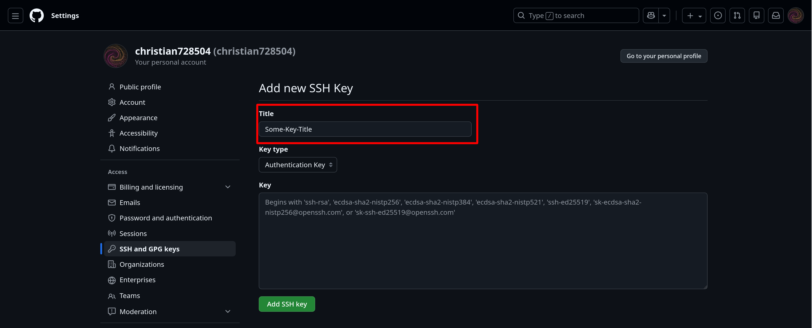

--- 
title: SSH
---

import { Steps } from '@astrojs/starlight/components'

General guides relating to the use of OpenSSH

## Setting up SSH keys with GitHub

If you are using GitHub for version control, you can set up SSH keys to authenticate with your GitHub account without having to enter your password every time.

First, generate a new SSH key pair:

```bash
ssh-keygen -t ed25519 -a 100 -f ~/.ssh/github
```

This will generate a public and private key pair.

Now edit you `~/.ssh/config` file and add the following lines:

```txt title="~/.ssh/config"
Host github.com
    AddKeysToAgent yes
    UseKeychain yes # macOS only
    IdentityFile ~/.ssh/github
```

You can then add the public key to your GitHub account by following these steps:

<Steps>
1. Open your GitHub account settings.

2. Go to the "SSH and GPG keys" section.

3. Click on "New SSH key".

4. Enter a title for your key.

5. Paste the contents of your public key file into the "Key" field.

6. Click "Add SSH key".
</Steps>

Test the connection by running `ssh -T git@github.com` and you should see a message indicating that the connection was successful.

Now, you can use the SSH key to log in to your GitHub account without having to enter your password every time.
