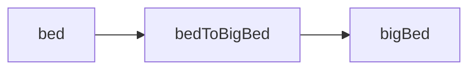
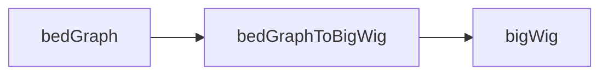
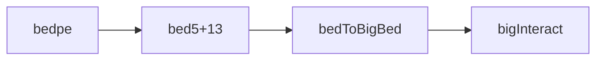

## 1. Overview of UCSC genome browser

The [UCSC Genome Browser](https://genome.ucsc.edu/) provides a rapid and reliable display of any requested genomic region at any scale. It supports a wide range of genome assemblies across various species (eg. human GRCh38 and mouse mm10) and includes dozens of aligned annotation tracks.  


&nbsp;

## 2. Supported data types

| Data Type | Description |
| --- | --- |
| **bam/cram** | Compressed Sequence Alignment/Map tracks |
| **bigBed** | Item or region tracks |
| **bigBarChart** | Bar charts of categorical variables displayed over genomic regions |
| **bigChain** | Genome-wide Pairwise Alignments |
| **bigGenePred** | Gene Annotations |
| **bigInteract** | Pairwise interactions |
| **bigLolly** | Lollipops |
| **bigNarrowPeak** | Peaks |
| **bigMaf** | Mulitple Alignments |
| **bigPsl** | Pairwise Alignments |
| **bigWig** | Signal graphing tracks |
| **hic: Hi-C** | Contact matrices |
| **halSnake** | HAL Snake Format |
| **vcfTabix** | Variant Call Format |
| **vcfPhasedTrio** | Variant Call Format Trios |
&nbsp;

## 3. Commonly used data types in Zlab

1. **bigBed**: Visualize regions such as varians, repeats, cCREs and ChIP-seq peaks.


2. **bigWig**: Visualize signals for assays such as ChIP-seq, ATAC-seq, DNase-seq and RNA-seq.


3. **bigInteract**: Visualize pairwise interactions for assays such as HiC and ChIA-PET.


&nbsp;

## 4. Data preparation

### ENCODE data

Find the data you want to visualize on the ENCODE portal, right click the download logo and copy the data URL(*copy link address*) for Genome Browser visualization.


&nbsp;

:::note
Most ENCODE data is available on the Zervers at ***/data/projects/encode/data/EID***.
:::

### Custom data transformation

UCSC developed various [tools](https://hgdownload.soe.ucsc.edu/admin/exe/linux.x86_64/) for data transformation.

#### bigBed

[BED](https://genome.ucsc.edu/FAQ/FAQformat#format1) (Browser Extensible Data) format



#### bigWig

[bedGraph](https://genome.ucsc.edu/goldenpath/help/bedgraph.html) format



#### bigInteract

[bedpe](https://bedtools.readthedocs/latest/content/general-usage.html) format,  [bigInteract](https://genome.ucsc.edu/goldenPath/help/interact.html) format




&nbsp;

## 5. How to make custom track

Custom track is useful for quickly browse one or a few datasets.
To add custom track, click **Custom Tracks** under the **My Data** tab and then click **Add custom tracks**. In the [page](https://genome.ucsc.edu/cgi-bin/hgCustom), paste in the data URL or upload from local.


&nbsp;

## 6. How to make track hub

Track hubs enable quick and organized visualization of large datasets. They also make it easy to share data, since collaborators can view your tracks directly in the genome browser with a simple URL.

### Public directory on Zerver

***/zata/public_html_users/username*** is available as ***https://users.wenglab.org/username*** (eg. https://users.wenglab.org/gaomingshi).

:::note[How do I setup my own public directory?]
Please contact the system administrators in #compute-support if you need help setting up your own directory.
:::

### Set up a folder for track hub

1. Classic 3-file style (useful if you have data from more than 1 genome assembly)

   - **hub.txt** (description of the track hub)
   - **genomes.txt** (specify the genome assemblies and corresponding trackDb.txt)
   - **trackDb.txt** (define the tracks)

track hub directory setup example:


1. 1-file style (easy setup for data from the same genome assembly, eg, GRCh38
   - **hub.txt** (add ***useOneFile on*** and ***genome xxx*** )


&nbsp;

### Entries of trackDb.txt

Specify each track in the trackDb.txt.


&nbsp;

5 basic parameters needed for a track are:

- `track` (track id, needs to be unique)
- `type` (data type)
- `bigDataUrl` (the path of data, supports both local path and URL)
  - local file (eg. ENCFF122BJN.bigWig, if the file is in the same directory as trackDb.txt)
  - URLs (https://www.encodeproject.org/files/ENCFF122BJN/@@download/ENCFF122BJN.bigWig)
- `short label` (label that shows up at the right side of the track in genome browser view)
- `long label` (label that shows up above the track in genome browser view)

other useful parameters:

- `autoScale On` (useful for scaling bigWig view)
- `maxHeightPixels` (height of track)
- `negateValues On` (useful for set - strand RNA-seq signal as negative value)
- `color` (set track color, supports RGB)
- `visibility` (set each track to ideal visibility)

### Prepare trackDb.txt / one-file hub.txt

To add an entry for each dataset, it's helpful to use a loop to modify a template file by inserting each dataset's unique metadata. Below is an example of how I created the ENCODE Epigenetics Collection hub.

- Screenshot of ATAC-seq metadata file:

- Template file **track.txt**:

```txt title="track.txt"
track File_Type_FID
type bigWig 
shortLabel EID
longLabel NAME File_Type signal
bigDataUrl https://www.encodeproject.org/files/FID/@@download/FID.bigWig
visibility full
maxHeightPixels 50
color RGB
autoScale on
```

- Code to prepare trackDb.txt:

```bash
rm -f trackDb.txt
for File_Type in ATAC DNase CTCF H3K4me3 H3K27ac
do
  cat ${File_Type}-List.txt | while IFS=$'\t' read -r EID FID name BIOTYPE Organ
  do
     NAME=$(echo $name | awk -F "_ENCDO" '{print $1}')
     RGB=$(grep -wi "${File_Type}" signal.color.txt | cut -f 2)
     echo -e "${File_Type}\t${OID}\t${EID}\t${BIOTYPE}\t${RGB}"
     
     sed -e "s/EID/${EID}/g" -e "s/FID/${FID}/g" \
         -e "s/File_Type/${File_Type}/" -e "s/RGB/${RGB}/" \
         -e "s|NAME|${NAME}|" track.txt > trackDb.txt
  done
done
```

### Share track hub with collaborators

1. Share the URL of ***hub.txt*** for people to load at **[track hub page](https://genome.ucsc.edu/cgi-bin/hgHubConnect)**, eg. http://users.wenglab.org/gaomingshi/ENCODE_Reg/hub.txt
2. Create a ***session*** and share session URL (for advanced users, need to create a UCSC Genome Browser account)
 see the following links for more details:
 https://genome.ucsc.edu/cgi-bin/hgSession
 https://genome.ucsc.edu/goldenPath/help/hgSessionHelp.html

## Useful links

- [Hub Track Database Definition](https://genome.ucsc.edu/goldenPath/help/trackDb/trackDbHub.html)
- Public Track Hub’s TrackDb files on Github (Example: [ENCODE regulation track hub](https://github.com/ucscGenomeBrowser/kent/blob/master/makeDb/trackDb/human/hg38/wgEncodeReg.ra))
- Lab Custom Track Color [Google sheet](https://docs.google.com/spreadsheets/d/1ugUQ_YngTJ8nZIvWFkCX0Pw7pm_TIwrNHfv5HzDru3Q/edit?usp=sharing)
- Kaili’s [slides](https://docs.google.com/presentation/d/100eeBsRgikA5TUX82qygyXFOTkhRbCTBSv8hAql_D-w/edit?usp=sharing) on downloading ENCODE data in batch
- My ENCODE metadata tutorial Google [colab](https://colab.research.google.com/drive/1-KfgiZKIlZ8pyL8y0JZobfV_2x6dNJra?usp=sharing)

## Debugging
- `shortLabel` needs to be shorter than 17 characters,
- `trackDb.txt` has trouble processing '  (quotation mark). Avoid using it if you can.
