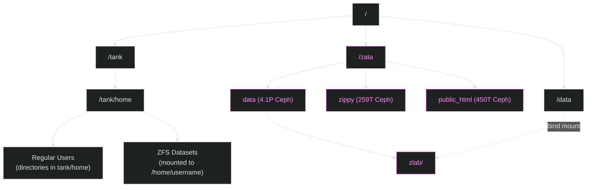

import { Icon } from '@astrojs/starlight/components';
import IconLabel from '../../components/ImageLabel.astro';
import IconAnaconda from '~icons/cib/anaconda';
import IconJupyter from '~icons/cib/jupyter';
import IconVSCode from '~icons/cib/visual-studio-code'
import { Steps, Code } from '@astrojs/starlight/components';

Onboarding for new lab members

:::caution[Before reading]
Please be aware of the following placeholder terms:

| Placeholder | Meaning |
|:--|:--| 
| `USERNAME` | your ZLab username |
| `GROUP` | - `zusers` if you are in ZLab <br /> - `musers` if you are in Moore Lab <br /> - `rusers` if you are a rotation student in either group. |
| `HOSTNAME` | hostname of server |
| `EDITOR` | text editor |

This page is meant to be read in sequential order.

In addition to this page, you may want to also check out the [onboarding document](https://docs.google.com/document/d/13stqSCGI-b3YhrTVcqsORaNqT1fq6N5KM2XLYV9futQ/edit?tab=t.0).
:::

## Remote Access

### Terminal Emulator

You will be spending alot of time in the terminal! That is why we recommend `ghostty`. [`ghostty`](https://ghostty.org/docs/install/binary) is a newer, more customizable terminal emulator available for Linux and macOS. Here is how to get started!

#### `TERM`

The `TERM` [environment variable](https://en.wikipedia.org/wiki/Environment_variable) is crucial for telling command-line interface (CLI) programs the capabilities of your terminal.

To configure this variable, add the following to your `~/.ssh/config` file (discussed [later](#update-ssh-config-file) in detail)

:::note
If the `~/.ssh/config` does not exist yet, you can create it by running:
```bash
mkdir -p ~/.ssh/config
chmod 600 ~/.ssh/config
```
:::

```txt title="~/.ssh/config"
SetEnv TERM=xterm-256color
```

#### Configuration

`ghostty` is [extremely configurable](https://ghostty.org/docs/config/reference). However none of this is *_required_*, so feel free to skip to the next topic.

To start configuring `ghostty`, start by creating the config file:

```bash
mkdir -p ~/.config/ghostty
vim ~/.config/ghostty/config
```

:::note
To exit and save from vim, type ":" + "wq" and hit enter.
:::

 If you prefer `nano`:

```bash
nano ~/.config/ghostty/config

Here is an example config to get started:

```python title="~/.config/ghostty/config"
shell-integration-features = ssh-terminfo,ssh-env
theme = Monokai Remastered
font-size = 18
background-opacity = 0.5
macos-titlebar-style = hidden
window-padding-y = 8,8
window-padding-x = 8,8
window-padding-balance = true
```
<details>
<summary>A note on `shell-integration-features`</summary>
All the feautres here are mainly for looks. However `shell-integration-features` is important! Upon the first SSH connection to a host, this settign means `ghostty` will try to copy its terminfo entry onto the host server. This will ensure the native `TERM` environment variable (in this case `xterm-ghostty`) is set correctly. If this fails though, it will fall backs to `xterm-256color`. All of this happens behind the scenes, but is useful to know incase the `TERM` environment becomes improperly configured at a later point for some reason.
</details>

Refer to the `ghostty` [documentation](https://ghostty.org/docs) to see all available configuration options.

### VPN Setup

Refer to the UMass Chan IT Deparment's instructions on VPN setup [here](https://umassmed.sharepoint.com/sites/information-technology/SitePages/VPN-Connect.aspx) (you will be prompted to login to your umassmed.edu Microsoft account).

<details>
<summary>Linux-specific VPN setup instructions</summary>
You can find all the available package distributions for the VPN client [here](https://www.dropbox.com/scl/fi/1dqjyldwafx0paorhavyg/Linux_Ivanti_22.8R3.zip?rlkey=d1psqq7175mad3rico8wjfbln&st=r8eiyk28&dl=0)
</details>

### <IconLabel icon="seti:windows">WSL (Windows-only)</IconLabel>

If on windows, you will have to install [WSL](https://learn.microsoft.com/en-us/windows/wsl/install) to launch a Linux VM from which you can SSH into the ZLab servers.

> [Basic WSL Commands](https://learn.microsoft.com/en-us/windows/wsl/basic-commands)

From `powershell` start your Linux (virtual machine) VM by running:

```bash
wsl.exe -d ubuntu
```

### SSH

The secure shell protocol (SSH) is how you will connect to the servers. However it requires some configuration first!

Start by creating the `~/.ssh` directory and `~/.ssh/config` file by running:

```bash
mkdir -p ~/.ssh/config
```

Edit the config file in a text editor ():

<details>
<summary>On command-line text editors</summary>
Learning to proficiently use a basic, no-frills command-line text editor can be immensely useful for making quick, small edits to files (such as now).

The text editors found on most [Unix-like operating systems](https://en.wikipedia.org/wiki/Unix-like) are:
- `nano`
- `vim`
- `emacs`

However there are some modern choices as-well:
- `neovim`
- `helix`
- `micro`
</details>

```bash
EDITOR ~/.ssh/config`
```

Add the following to the config file:

```text title="~/.ssh/config" showLineNumbers
Host *
     TCPKeepAlive = yes
     ServerAliveCountMax = 3
     ServerAliveInterval = 30
     ForwardX11 = yes
     ForwardX11Trusted = yes
     ControlMaster auto
     ControlPath ~/.ssh/sockets/%r@%h:%p
     ControlPersist 60

Host z010 z011 z012 z013 z014
     ProxyCommand=ssh -W %h:%p -l %r bastion.wenglab.org
     ForwardX11 yes
     ForwardAgent yes
     ForwardX11Timeout 7d
     ServerAliveCountMax 3
     ServerAliveInterval 15
     GSSAPIAuthentication yes
     User USERNAME
```

:::danger[Make sure to create the `~/.ssh/sockets` directory]
```bash
mkdir -p ~/.ssh/sockets
```

This is required since our config set `ControlMaster` to `auto` which enables SSH multiplexing for [OpenSSH](https://www.openssh.org/). This feature allows multiple SSH connections to share the same underlying network connection, which can speed up subsequent connections by avoiding repeated authentication.
:::

### First-time Login

To login to the servers, open an SSH connection by running:
```bash
ssh USERNAME@bastion.wenglab.org
```

<details>
<summary>Storage partitioning layout</summary>

</details>

If it's your first time logging in, you will be prompted to scan the QR code (OTP). Register the OTP with a 2FA application (i.e. Microsoft Authenticator, Google Authenticator, Authy, Ente Auth, etc.).

Afterwards, you should be prompted to change your password.

:::caution
Save this QR code in a secure location.
:::

:::note
From this point forward, every time you login, you will prompted to provide your password and two-factor code (as one string with no spaces).
:::

After logging in, you will be on the [bastion server](https://en.wikipedia.org/wiki/Bastion_host). This is a security feature, which [air gaps](https://en.wikipedia.org/wiki/Bastion_host) the internal servers.

Once you've authenticated with the bastion server, you can SSH into any of the ZLab servers by running:

```bash
ssh HOSTNAME
```
#### Server Usage Guidelines

:::caution
Please read the [server usage guidelines](https://docs.google.com/document/d/1X3gSpfv0avT3M3pN5HDbY3Etal_is9be-B6wJ4DJ7Fw/edit?usp=sharing) before using any of the servers.
:::

## Software

You can find all the software tutorials [here](../devops-tutorials/). For now we'll go through some need-to-know software to get you up and running.

### Enviornment management

#### Types

**Virtual Enviornment**

Typically, a collection of dependencies (could be language specific) that ensure the application or program of interest runs in isolation from global, system dependencies. `conda` is a widely-used in bioinformatics as the defacto virtual environment manager and dependency resolver.

**Containers**

A different technology altogether, 'containerization' isolates the application or program of interest in a virtual process. This method usually offers a higher level of abstraction/isolation, in which each virtual process can have its own space, file system, network space, etc. Two widely-used programs for containerization are `docker` and `singularity`.

### <span style="display: inline-flex; align-items: center; gap: 1rem;"><IconAnaconda /> Conda</span>

To install Conda, run the following:

```bash
curl -L -O "https://github.com/conda-forge/miniforge/releases/latest/download/Miniforge3-$(uname)-$(uname -m).sh"
bash Miniforge3-$(uname)-$(uname -m).sh -p /zata/zippy/$(whoami)/Miniforge3
source ~/.bashrc
```

:::tip
The `whoami` command returns your username. The `$(whoami)` expression is a command substitution which executes the command and captures the output.
:::

<details>
<summary>Conda too slow?</summary>
While Conda has come a long way in [recent years](https://www.anaconda.com/blog/a-faster-conda-for-a-growing-community) it still can be quite slow. This is especially the case for large, complex environment definitions, where resolving pacakge depdencies can take minutes. 

In these situations, you may want to use `mamba`, which is a [C++ reimplementation](https://github.com/mamba-org/mamba) of the core parts of the conda package manger. Put simply, it is faster than conda, while maintaining compatiblity with `conda`.

:::tip
You may need to run `mamba init` if this is your first time using `mamba` and then update your current `SHELL` with `source ~/.bashrc`.
:::

There is also a **standalone version** of mamba you can install called `micromamba` Refer to the installation instructions [here](https://mamba.readthedocs.io/en/latest/installation/micromamba-installation.html).
</details>

Now create your first conda environment:

```bash
mamba create -n myenv jupyterlab numpy pandas matplotlib bedtools -c bioconda
```

### Singularity

#### Build the singularity image

The remote docker image [`clarity001/bioinformatics:latest`](https://hub.docker.com/r/clarity001/bioinformatics/tags) contains a full suite of bioinformatics software that you will most likely need.

Build the singularity image file (.sif):

```bash
singularity build /zata/zippy/$(whoami)/bin/bioinformatics.sif docker://clarity001/bioinformatics:latest
```

To start an interactive shell in the container (_optional_):

```bash
singularity shell -B /data,/zata /zata/zippy/$(whoami)/bin/bioinformatics.sif
```

#### <IconLabel icon="seti:docker">Docker</IconLabel>

:::note[What is *_rootless_* Docker?]
Rootless Docker enables users to run containers without administrator privileges. This is the version of docker which you will be configuring.
:::

:::caution
If you encounter any issues with setting up rootless Docker, reach out to one of the admins on the [*_#compute-support_*](https://zlab-umass.slack.com/archives/C0105C0RYLC) channel on Slack.
:::

```bash
mkdir -p ~/.config/docker/
echo '{"data-root":"/rootless/docker/'$(whoami)'/docker"}' > ~/.config/docker/daemon.json
dockerd-rootless-setuptool.sh install
```

## IDE

An [integrated development environment (IDE)](https://en.wikipedia.org/wiki/Integrated_development_environment) is where most of your code editing and other tasks with take place as it pertains to computational bioinformatics work. There are a couple of choices here, so lets go over the process to set them up.

### <span style="display: inline-flex; align-items: center; gap: 1rem;"><IconJupyter /> Jupyterlab</span>

Jupyterlab is a web-based IDE specifically designed for development in notebooks. The definition of a "notebook", as per [Project jupyter](https://docs.jupyter.org/en/latest/#what-is-a-notebook) is:

> A [notebook is a] shareable document that combines computer code, plain language descriptions, data, rich visualizations like 3D models, charts, graphs and figures, and interactive controls. A notebook, along with an editor (like JupyterLab), provides a fast interactive environment for prototyping and explaining code, exploring and visualizing data, and sharing ideas with others.

<Steps>

<ol>

<li>
#### Start JupyterLab with Singularity:

```bash
singularity exec -B /data,/zata /zata/zippy/$(whoami)/bin/bioinformatics.sif jupyter lab --port=8888 --ip=HOSTNAME --no-browser --notebook-dir=/data/GROUP/$(whoami)
```
</li>

<li>
#### Start Jupyterlab with Conda:

```bash
conda activate myenv
jupyter-lab --port=8888 --ip=HOSTNAME --no-browser
```
</li>

<li>
#### Connect to Jupertylab

To access the Jupyterlab server on your client device, setup an SSH port forward by running:

```bash
ssh -N -L 8888:HOSTNAME:8888 USERNAME@HOSTNAME
```

<details>

<summary>Description of SSH command</summary>

You can read up on SSH port forwarding [here](https://docs.oracle.com/en/operating-systems/oracle-linux/openssh/openssh-SettingUpPortForwardingOverSSH.html).

| Command | Description |
|---------|-------------|
| `ssh` | The secure shell program that creates encrypted connections |
| `-N` | Flag that means "don't execute a remote command/shell" - just forward ports |
| `-L` | Flag for "local port forwarding" |
| `8888:` | The local port on your computer |
| `HOSTNAME:` | The destination server's address (check your ssh config for available hosts) |
| `8888` | The remote port on the destination server |
| `USERNAME@HOSTNAME` | Username and server address to login to |

</details>
</li>

<li>
#### Open Jupyterlab 

Go to <a href="http://127.0.0.1:8888/lab">http://127.0.0.1:8888/lab</a> in your browser.
</li>

</ol>

</Steps>

### <span style="display: inline-flex; align-items: center; gap: 1rem;"><IconVSCode /> VSCode</span>

Compared to Jupyterlab, which caters mainly towards notebook, Python, Bash, and R users, VSCode is an industry standard IDE for all code-editing needs. Here is how you can setup a remote VSCode server on the servers.

<Steps>

<ol>

<li>
#### Clone the `code-server` repository

To download the Dockerfile, run:
```bash
mkdir -p ~/.config/code-server/config
git clone https://github.com/christian728504/code-server.git
cd code-server
```
</li>

<li>
#### Inspect the Dockerfile

The Dockerfile in `code-server` is meant to be a blank canvas. If you require additional dependencies, add them to the Dockerfile and rebuild/restart the container. Or if you would like to upstream these changes, make a pull request to [christian728504/bioinformatics](git@github.com:christian728504/bioinformatics.git) which contains the Dockerfile for the base image.
:::tip
A `Dockerfile` is a [set of build instructions for building a docker container](https://docs.docker.com/build/concepts/dockerfile/). For more info on Docker, please read our [tutorial](./devops-tutorials/docker-containerization.mdx)
:::
:::danger
If you do install any packages during runtime, remember **they are not persistent**!
:::
</li>

<li>
#### Run `docker-compose`

Now run docker compose in the directory with `docker-compose.yml`.
```bash
docker compose up -d
```
</li>

<li>
#### Authenticate with GitHub

:::note
Before proceeding with this step, make sure you have a [github account](https://github.com/signup).
:::
If the Docker container started successfully, run `docker compose logs code-server`. Your are looking for an output like this:
```log
code-server  | *
code-server  | * Visual Studio Code Server
code-server  | *
code-server  | * By using the software, you agree to
code-server  | * the Visual Studio Code Server License Terms (https://aka.ms/vscode-server-license) and
code-server  | * the Microsoft Privacy Statement (https://privacy.microsoft.com/en-US/privacystatement).
code-server  | *
code-server  | [2024-12-31 22:33:18] info Using GitHub for authentication, run `code tunnel user login --provider <provider>` option to change this.
code-server  | To grant access to the server, please log into https://github.com/login/device and use code XXXX-XXXX
```
Take note of:
1. The github link `https://github.com/login/device`
2. and the code `XXXX-XXXX` (placeholder)

Visit the [device login page](https://github.com/login/device), you should be prompted to authenticate with the 8 character code. Go to the VSCode IDE on your client machine and open the command palette with `CMD + SHIFT + P` (macOS) and type `Remote-Tunnels: Connect to Tunnel`. Select the Github authentication option. Wait a bit, and you should see one remote resource "online." Once you've added the remote connection and opened a remote directory, you should be all set!
<br />
</li>

<li>
#### Reconnect to the tunnel

After you close VSCode, the tunnel will automatically close. However, the server will still be running on the remote machine. To reconnect the tunnel, you will need to SSH back into the server from which you started the remote container.
</li>

<li>
#### Usage of Jupyterlab

If you want to make use of jupyter notebooks, you'll need to install the `Jupyter` extension (on both server and client device). After this you should be able to select from the available kernels (Python, Bash, R).
</li>

</ol>

</Steps>
